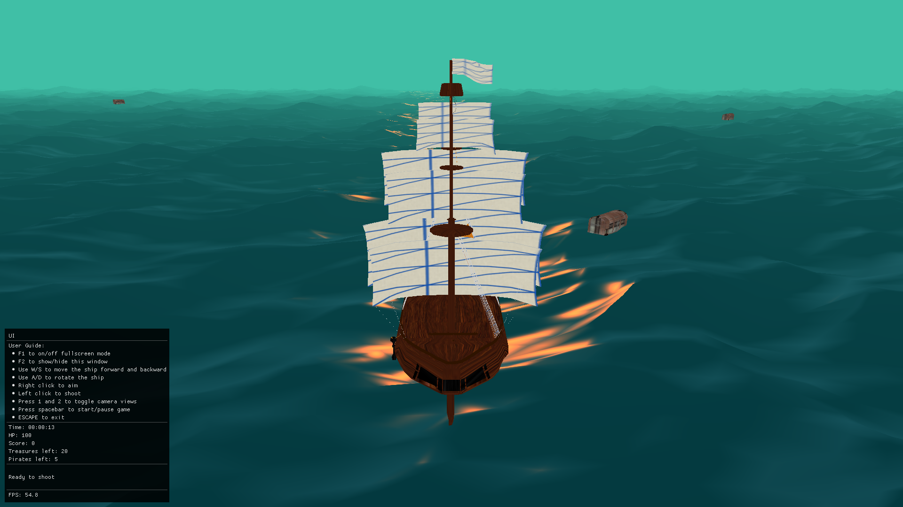
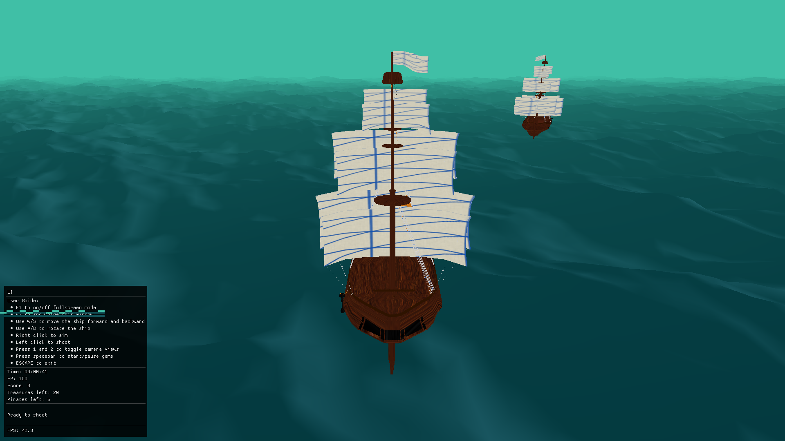

# Black Flag

A 3D game developed using OpenGL involving naval battles with pirates
in a clear ocean. The player is required to eliminate pirate ships and collect treasure chests.





## Prerequisites

Generating build files for your OS and build system requires CMake.
Most of the dependencies are bundled with the repository as git submodules.
This includes:

* [glad](https://github.com/Dav1dde/glad) - OpenGL Function Loader.
* [glfw](https://github.com/glfw/glfw) - Windowing and Input.
* [glm](https://github.com/g-truc/glm) - OpenGL Mathematics.
* [plog](https://github.com/SergiusTheBest/plog) - Logging library.
* [imgui](https://github.com/ocornut/imgui) - UI library.

## Dependencies


The following instructions apply to:

* Ubuntu 20.04, 18.04, 16.04
* Debian 9 and higher

```
sudo apt-get install -y \
    build-essential \
    cmake \
    xorg-dev \
    libgl1-mesa-dev \
    libfreetype6-dev
```

The following instructions apply to:

* Fedora 22 and higher

```
sudo dnf install -y \
    gcc gcc-c++ make \
    cmake \
    mesa-libGL-devel \
    libXrandr-devel \
    libXinerama-devel \
    libXcursor-devel \
    libXi-devel \
    freetype-devel
```

* CentOS 7 and higher

```
sudo yum install -y \
    gcc gcc-c++ make \
    cmake \
    mesa-libGL-devel \
    libXrandr-devel \
    libXinerama-devel \
    libXcursor-devel \
    libXi-devel \
    freetype-devel
```

## Setup

Run the following script to build and launch the game.

```bash
./run.sh
```

If the build files are already generated, the game can be directly launched by the following commands.
    
```bash
cd render
./Game
```